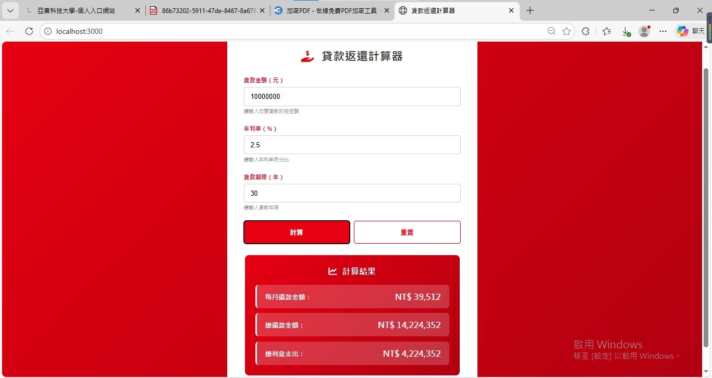
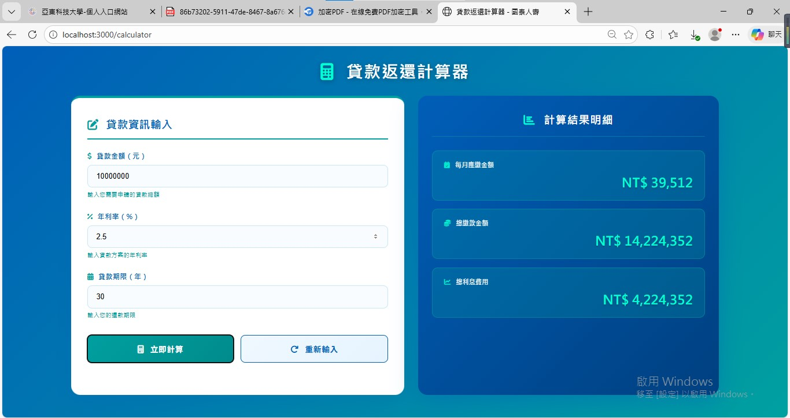
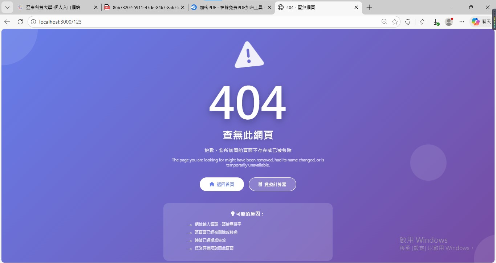
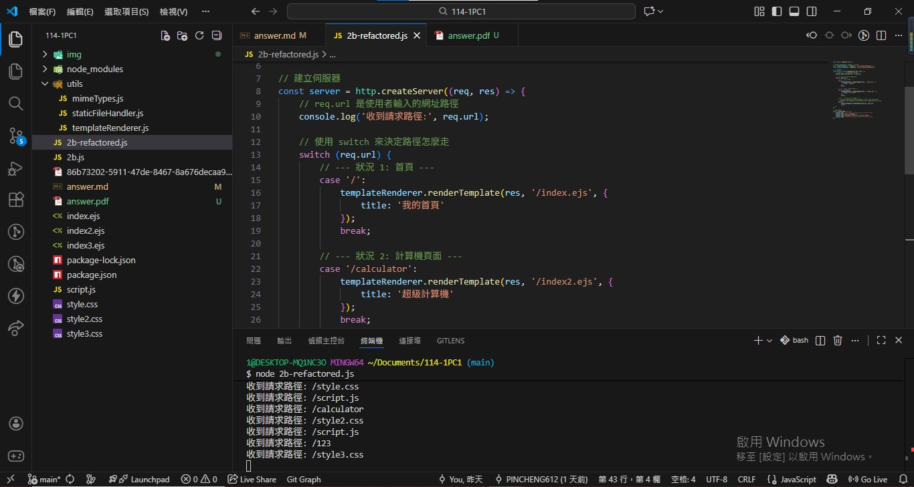

# 第1次練習題目-練習-PC1
>
>學號：112111113  (學號和姓名都要寫)
><br />
>姓名：林品承
>

本份文件包含以下主題：(至少需下面兩項，若是有多者可以自行新增)
- [x] 說明內容
---
1. 請將2b.js重構為模組化設計，建⽴2b-refactored.js ，使主檔案專注於路由邏輯，並將共同功能抽取成獨⽴的ES6模組

Ans: 
## 第⼀部分：建⽴MIME型模組
檔案位置為 utils/mimeTypes.js
```js
// 1. 定義一個「物件 (Object)」，像是字典的感覺
// 左邊是副檔名，右邊是瀏覽器看得懂的類型名稱
const contentTypes = {
    '.html': 'text/html; charset=utf-8',
    '.ejs': 'text/html; charset=utf-8',
    '.js': 'text/javascript; charset=utf-8',
    '.css': 'text/css; charset=utf-8',
    '.json': 'application/json',
    '.png': 'image/png',
    '.jpg': 'image/jpg',
    '.gif': 'image/gif',
    '.svg': 'image/svg+xml',
    '.ico': 'image/x-icon'
};

// 2. 定義一個功能函數：輸入副檔名，回傳類型
const getContentType = (extname) => {
    // 嘗試在字典裡找，如果找不到，就給預設值 'text/plain' (純文字)
    return contentTypes[extname] || 'text/plain';
};

// 3. 把這個函數打包匯出，讓別人可以使用
module.exports = { getContentType };
```
- 這支程式主要目的為告訴瀏覽器如何正確解讀伺服器傳回的檔案
- getContentType 這個函數接收一個參數 extname；contentTypes[extname] 會去上面的物件裡查找對應的值
- 這邊的 || (or 運算子) 是一個保護機制
- module.exports = { getContentType }; 是將 getContentType 這個函數公開出去
- 解決檔案識別的問題，確保前端瀏覽器能正確呈現圖片、執行腳本或渲染網頁樣式

***

## 第⼆部分：建⽴模板渲染模組

Ans:<br>
檔案位置為 utils/templateRenderer.js
```js
// 引入需要的內建工具
const fs = require('fs');  // 讀檔案用
const ejs = require('ejs'); // 轉換 EJS 用

// 1: 渲染 (Render) 模板
// 參數說明：
// res: 用來回應給瀏覽器的物件
// filePath: 檔案路徑 (例如 '/index.ejs')
// data: 要傳給 EJS 的變數資料 (預設是空物件 {})
const renderTemplate = (res, filePath, data = {}) => {
    // 組合完整路徑，例如 '.' + '/index.ejs' 變成 './index.ejs'
    const fullPath = '.' + filePath;

    // 開始讀取檔案
    fs.readFile(fullPath, 'utf8', (err, template) => {
        // --- 狀況 A: 讀取檔案發生錯誤 (例如檔案不存在) ---
        if (err) {
            console.log('讀取錯誤:', err.message); // 在終端機顯示錯誤
            res.writeHead(500, { 'Content-Type': 'text/html; charset=utf-8' });
            res.end('<h1>伺服器錯誤</h1><p>無法讀取檔案</p>');
            return; // 結束函式，不要往下執行
        }

        // --- 狀況 B: 讀取成功，開始轉換 EJS ---
        try {
            // 準備要傳給畫面的資料，預設給它一個 title 以防萬一
            const safeData = { 
                title: '網站', 
                msg: '', 
                ...data  // 把外部傳進來的 data 蓋過去
            };

            // 使用 EJS 引擎將模板轉成 HTML 字串
            const html = ejs.render(template, safeData);

            // 告訴瀏覽器：這是 HTML，請求成功 (200)
            res.writeHead(200, { 'Content-Type': 'text/html; charset=utf-8' });
            res.end(html);

        } catch (renderErr) {
            // 如果 EJS 語法寫錯，會在這裡被抓到
            console.log('EJS 轉換錯誤:', renderErr.message);
            res.writeHead(500);
            res.end('EJS 轉換失敗');
        }
    });
};

// 2: 顯示 404 頁面
// 這是一個捷徑，直接呼叫上面的 renderTemplate 去讀取 index3.ejs
const render404 = (res) => {
    renderTemplate(res, '/index3.ejs', { title: '404 找不到' });
};

// 匯出這兩個功能給別人用
module.exports = { renderTemplate, render404 };
```
- 這支程式專門用來處理動態網頁(EJS)。把 EJS 模板檔案讀進來，填入資料，變成瀏覽器看得懂的 HTML，然後傳送出去。
- 核心功能為renderTemplate。讀取檔案 (fs.readFile) 它會根據你給的路徑（例如 /index.ejs）去把檔案內容抓出來；如果檔案找不到或無法讀取，它會進入 if (err) 區塊，回傳 500 (伺服器內部錯誤)，而不是讓伺服器當機
- 編譯模板 (ejs.render)這是 EJS 發揮作用的地方。它把剛才讀到的 template 和 safeData 混合在一起，生成最終的 HTML 字串；使用 try...catch 包起來。萬一 EJS 檔案裡面語法寫錯了，程式會捕捉到 (catch)，然後回傳「EJS 轉換失敗」，而不是讓整個網站掛掉。
- 發送回應 (res.end) 最後，設定好標頭 (200 OK, Content-Type)，把生成的 HTML 寄給瀏覽器

***

## 第三部分：建⽴靜態⽂件處理模組

Ans:<br>
檔案位置為 utils/staticFileHandler.js
```js
const fs = require('fs');
const path = require('path');

// 這裡要引入剛剛寫好的另外兩個模組
const mimeTypes = require('./mimeTypes'); 
const templateRenderer = require('./templateRenderer');

// 定義功能: 處理靜態檔案
const handleStaticFile = (res, filePath) => {
    const fullPath = '.' + filePath;
    
    // 取得副檔名，例如 '.css' 或 '.jpg'
    const extname = path.extname(fullPath);

    // 讀取檔案 (這裡不寫 'utf8'，因為圖片不是文字)
    fs.readFile(fullPath, (err, content) => {
        if (err) {
            // 如果找不到檔案，就顯示 404 頁面
            // 我們直接借用 templateRenderer 的功能
            templateRenderer.render404(res);
        } else {
            // 檔案讀到了！
            
            // 1. 去詢問 mimeTypes 模組這是什麼類型的檔案
            const contentType = mimeTypes.getContentType(extname);

            // 2. 設定檔頭並傳送檔案
            res.writeHead(200, { 'Content-Type': contentType });
            res.end(content);
        }
    });
};

// 匯出功能
module.exports = { handleStaticFile };
```
- 這支程式為靜態檔案處理。就是負責把這些檔案正確地送到使用者瀏覽器上
- const mimeTypes = require('./mimeTypes'); 這邊引入了第一個模組 (mimeTypes) 來查詢檔案身分（圖片或文字）。
- const templateRenderer = require('./templateRenderer'); 這邊引入了第二個模組 (templateRenderer) 來處理找不到檔案的情況（顯示 404 頁面）。
- 上述兩個引入模組讓這支程式碼專注於讀檔與傳送，不用管其他的邏輯
- fs.readFile(fullPath, (err, content) => { ... }) 這邊因為是圖片而非文字，因此不用加'utf8'
- if (err) {templateRenderer.render404(res);} 這邊如果使用者請求了 /style.css 但伺服器上沒這檔案，程式會進入錯誤區塊；它會直接呼叫我們上一段寫好的 render404，顯示漂亮的「找不到頁面」

***

## 第四部分：重構主檔案

Ans:<br>
檔案位置為 2b-refactored.js
```js
const http = require('http');

// 引入我們的工具箱 (路徑要有 ./utils/)
const templateRenderer = require('./utils/templateRenderer');
const staticFileHandler = require('./utils/staticFileHandler');

// 建立伺服器
const server = http.createServer((req, res) => {
    // req.url 是使用者輸入的網址路徑
    console.log('收到請求路徑:', req.url);

    // 使用 switch 來決定路徑怎麼走
    switch (req.url) {
        // --- 狀況 1: 首頁 ---
        case '/':
            templateRenderer.renderTemplate(res, '/index.ejs', {
                title: '我的首頁'
            });
            break;

        // --- 狀況 2: 計算機頁面 ---
        case '/calculator':
            templateRenderer.renderTemplate(res, '/index2.ejs', {
                title: '超級計算機'
            });
            break;

        // --- 狀況 3: 其他所有路徑 ---
        // 如果不是上面定義的頁面，就假設它是要拿檔案 (CSS/圖片)
        // 或者如果檔案真的不存在，handleStaticFile 裡面會幫轉去 404
        default:
            staticFileHandler.handleStaticFile(res, req.url);
            break;
    }
});

// 啟動伺服器
server.listen(3000, () => {
    console.log('---------------------------------------');
    console.log('伺服器啟動成功！');
    console.log('請打開瀏覽器：http://localhost:3000');
    console.log('---------------------------------------');
});
```
- 這支程式將所有功能整合在一起，啟動伺服器並開始監聽使用者的請求
- default:staticFileHandler.handleStaticFile(res, req.url); break; 這個地方同時兼顧了「靜態檔案服務」和「404 錯誤攔截」的功能

### 小總結：
這四組程式碼組合在一起，就是是一套非常標準的 MVC 架構的雛形，包含： mimeTypes.js 為資料層、 templateRenderer.js 為視圖層、 staticFileHandler.js 為靜態資源層、 2b-refactored.js 為控制層。


<br>
▲  case "/" 
<br>

<br>
▲  case "/calculator"
<br>

<br>
▲  case "default"
<br>

<br>